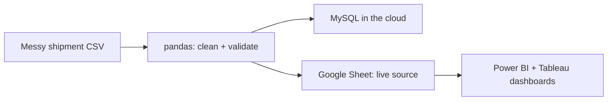
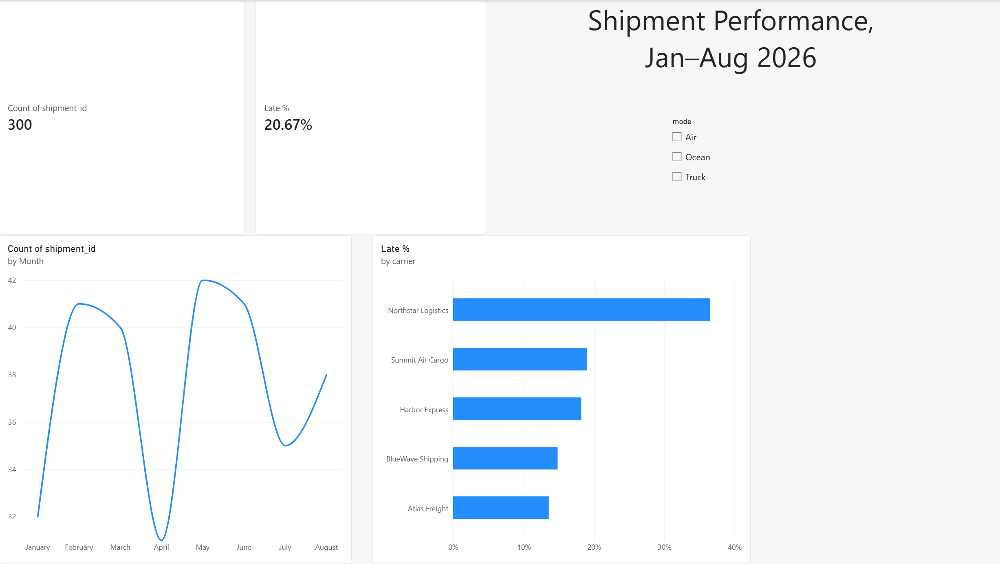
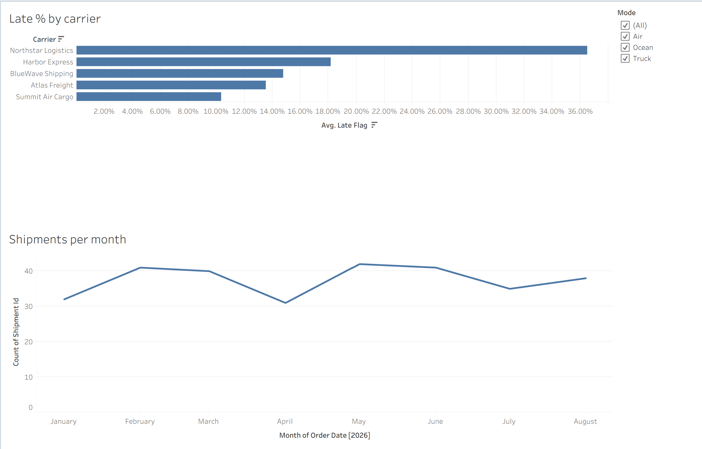

# Supply Chain Shipment Analytics: End-to-End Data Pipeline

An end-to-end practice project: messy shipment data is cleaned and validated in **Python (pandas)**, stored in a **cloud MySQL database**, and visualized in **Power BI** and **Tableau** dashboards connected to a live data source.

> The data is synthetic (1,225 shipments from 5 fictional carriers, Jan–Aug 2026), generated for practice.

## Pipeline



## Key findings

| Finding | Result |
| --- | --- |
| Late-delivery rate, Northstar Logistics | 32.5% (more than 2x the other carriers, 10.7–14.8%) |
| Seasonal spike | June 27.3% and July 23.7% late vs. 12–16% in other months |
| Median freight cost per kg | Air $8.31 · Truck $1.92 · Ocean $1.05 |

## 1. Data cleaning and validation (Python, pandas)

Notebook: [`notebooks/project2_pandas.ipynb`](notebooks/project2_pandas.ipynb)

Found and fixed six data-quality issues:

- 25 duplicate rows
- 5 carriers spelled 15 different ways
- Freight costs stored as text (`"$1,234.50"`)
- Two date formats mixed in the same column
- Impossible values (negative weights, deliveries dated before shipment)
- Missing weights, filled with the median for that shipping mode

Stretch: a logistic regression (scikit-learn) to predict late shipments. It scored about 83% accuracy, the same as always guessing "on time". This shows why accuracy is misleading when the outcome is rare (17% of shipments were late).

## 2. Cloud database (MySQL)

Notebook: [`notebooks/project3_mysql_cloud.ipynb`](notebooks/project3_mysql_cloud.ipynb) · SQL: [`sql/schema_and_queries.sql`](sql/schema_and_queries.sql)

- Deployed a managed MySQL database on Aiven and connected from Python (SQLAlchemy) over SSL
- Designed a normalized schema: `carriers` and `shipments` tables linked by a foreign key, with CHECK constraints
- Loaded the cleaned data and checked that row counts matched (1,200 = 1,200)
- Fixed a load failure caused by a date-format change between tools (`5/21/2026` vs. `2026-05-21`) by standardizing dates before inserting
- Analysis queries using JOIN, GROUP BY, HAVING and CASE; results match the pandas analysis

## 3. Dashboards (Power BI and Tableau)

- **Tableau Public:** [link to your dashboard](PASTE-YOUR-TABLEAU-PUBLIC-LINK-HERE)
- **Power BI:** connected to a published Google Sheet via the Web connector; DAX measure for late %; tested a live refresh by editing the source




## Tools

Python · pandas · scikit-learn · SQL · MySQL · SQLAlchemy · Power BI (DAX, Power Query) · Tableau · Google Colab · Git/GitHub

## Repository layout

```
data/        raw, cleaned and dashboard CSVs
notebooks/   Colab notebooks (cleaning, database)
sql/         schema and analysis queries
dashboards/  Power BI .pbix file (open in Power BI Desktop)
images/      dashboard screenshots
```
